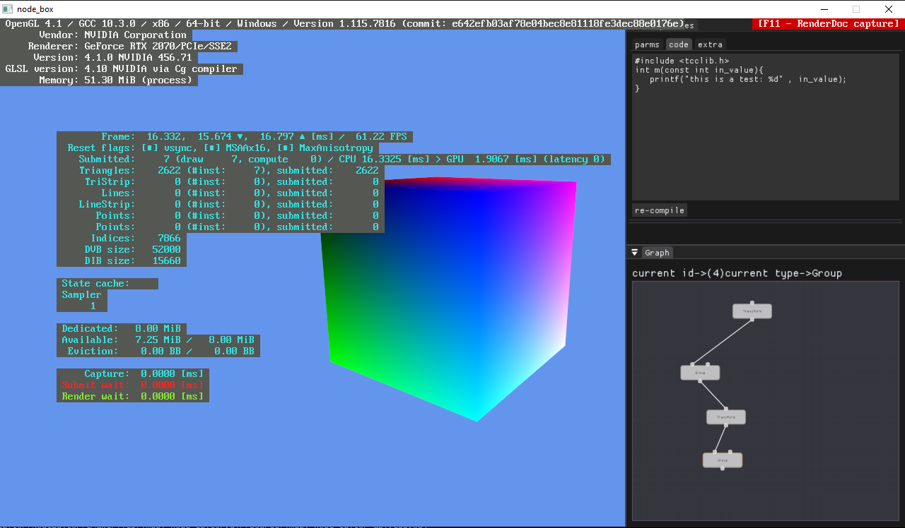

# engine_core

Borrowed some stuff verbatim from https://github.com/pr0g/sdl-bgfx-imgui-starter mostly the setup scripts + the cmake scripts. This is setup as template for some graphics libraries for personal use.

requires glm, sdl2, imgui (docking-layout custom branch), imgui-node-editor, bgfx (cmake branch), tinycc (for runtime C compilation)

The third-party cmakelist should pull everything from various repos, build that then build the main program

I have only tested this on mingwin64 on windows. It might work on linux?
There are a few .sh files that could be modified for various cmake commands on other os

Basic setup in a mingw shell:
```
git clone --recursive https://github.com/nlapinski/engine_core.git
cd engine_core
git submodule update --init --recursive
cd third-party
./install.sh
cd ..
./configure-ninja.sh
./compile-shaders-win-glsl.bat
./run.sh
```


I'm still fixing the install cmakes for tinycc - currently run.sh moves the required librarys and includes to the build for tinycc to compile stuff
